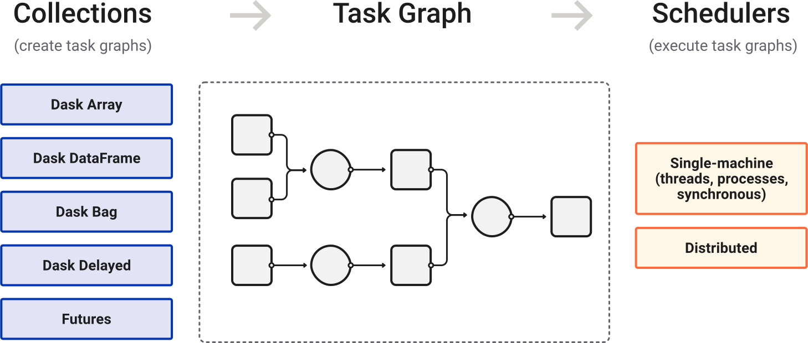
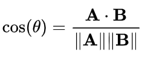

### **Spotify Hybrid Recommendation System**
The goal of this project is to increase the user engagement and retention by providing personalized and variety of recommendations to the users. Here, we trained Content based Recommendataion using attributes and metadata of the songs dataset of [**Million Song Dataset Spotify Last.fm**](https://www.kaggle.com/datasets/undefinenull/million-song-dataset-spotify-lastfm) and Collaborative filtering Recommendation using user-item interaction dataset.
We want to increase the **Click Through Rate** (CTR measures the ratio of users who click on a specific song out of total recommendations to the number of total users) means i want the user to click on the recommended song and listen to it. We will be using **Weighted Hybrid** approach to combine the outputs (similarity scores) of both content based and collaborative filtering recommendation systems to generate final recommendations. Also, we want to increase the **User Conversion Rate**(number of users who convert to paid subscribers out of total users) and lower the **Churn Rate** (Churn rate is the percentage of users who stop using the service over a given period of time).
We will be using Docker and Git tags for version control instead of mlflow's model registry as no model is being trained in this project.
Features:
1. The takes song as input and give 10 **Content Based Recommendation** of songs.
2. Create *Item-User Interaction Matrix* Table by find top 10 similar songs which other users are listening using **Collaborative Filtering Recommendation**.
3. Combine the outputs of both *content based* and *collaborative filtering* recommendation systems using **Weighted Hybrid** approach to generate final **Hybrid Recommendations**.

> NOTE: Chunking using `Dask` is used to handle large datasets as it is similar to Pandas and Numpy. It work fine for parallel computing with multiple cores and distributed computing like k8s cluster.

1. `Client` : It interact with User and covert the user request to Task Graph and send it to `Dask Scheduler` for execution. It also collect the results from `Dask Scheduler` and send it back to User.
2. `Dask Scheduler` : It understand which tasks can be parallelized in the `Task Graph` and schedule the tasks to `Worker` for execution.
3. `Worker` : multiple cores of CPU or multiple nodes of cluster can be used to run the tasks in parallel. It is responsible for executing the tasks and returning the results to `Dask Scheduler`.

---

### **Recommendation Systems**
are the algorithm that monitor user preferences and behavior to predict what they will like. It can also detect change in user pattern and adapt to it. Example: 1. Media Streaming (Netflix, Spotify) 2. E-commerce (Amazon & Flipkart) 3. Social Media (YouTube, Instagram) etc.

### **Types of Recommendation Systems**:
1. **`Popularity-based`**: Recommends items based on their overall popularity. easy to implement and no need of user data. highly scalable. no personalization and bais towards popular items (not local/niche items) and lack of diversity in recommendations.
2. **`Content-based Filtering`**: Recommends items similar to those a user has liked in the past (User's History). recomment similar content based on metadata or attributes of user's current content. more personalized and can recommend niche items. disadvantages are `over-specialization` (recommending items too similar to what user has already liked) and cold start problem (difficulty in recommending items to new users or recommending new items) and no diversity in recommendations.
3. **`Collaborative Filtering`**: Recommends items based on the preferences of similar users. It has diversity in recommendations and scalability and don't rely on item's metadata. Disadvantages are cold start problem (like new users or new items) and computationally expensive (especially for large datasets). Two types of collaborative filtering are:
    - **`User-based`**: Recommends items that similar users have liked.  It is used when `number of items` is much larger than `number of users`. Example: Instagram etc.
        - Step 1: Calculate similarity between users based on their preferences.
        - Step 2: Select the most similar users to the target user.
        - Step 3: Recommend items that those similar users have liked but the target user has not interacted with. 
    - **`Item-based`**: Recommends items that are similar to items the user has liked. It is used when `Number of users` is much larger than `number of items`. Users in column and items in rows. Example: Netflix etc.
        - Step 1: Calculate similarity between items based on user interactions.
        - Step 2: Select the most similar items to those the target user has interacted with.
        - Step 3: Recommend items that are similar to those the target user has liked but has not interacted with.
4. **`Hybrid`**: Combines multiple recommendation techniques to leverage their strengths and mitigate their weaknesses. It can provide more personalized, dynamic and diverse recommendations by combining the advantages of different approaches. Disadvantages are increased complexity in implementation and maintenance, and potential for overfitting if not properly balanced. It can be implemented 8h various ways, such as:
    - **`Weighted hybrid`**: Assigns weights to the outputs (similarity scores) of different recommendation techniques and combines them to generate final recommendations.
    - **`Switching hybrid`**: Dynamically selects which recommendation technique to use based on certain criteria, such as user behavior or item characteristics.
    - **`Feature combination hybrid`**: Combines features from different recommendation techniques into a single model for generating recommendations.

### **Types of Similarity Measures Used in Recommendation Systems**:
1. **`Cosine similarity`**: Measures the cosine of the angle between two vectors. We will be using this one because it is immune to course of dimensionality and range between -1 and 1. -1 is 180 degree, 0 is no similarity i.e. 90 degree and 1 is 0 degree.



2. **`Pearson correlation`**: Measures the linear correlation between two variables
3. **`Jaccard similarity`**: Measures the similarity between two sets by dividing the size of their intersection by the size of their union.
4. **`Euclidean distance`**: Measures the straight-line distance between two points in a multi-dimensional space.
5. **`Manhattan distance`**: Measures the distance between two points in a grid-based system by summing the absolute differences of their coordinates.

Metrics to evaluate the performance of recommendation systems (need labelled data):
1. **`Precision@K`**: Measures the proportion of recommended items in the top K that are relevant.
2. **`Recall@K`**: Measures the proportion of relevant items that are recommended in the top K.

**Model based Recommendation Systems** generally used in collaborative filtering recommendation systems like `SVD Factorization`.

## Project Organization

```
├── LICENSE            <- Open-source license if one is chosen
├── Makefile           <- Makefile with convenience commands like `make data` or `make train`
├── README.md          <- The top-level README for developers using this project.
├── data
│   ├── external       <- Data from third party sources.
│   ├── interim        <- Intermediate data that has been transformed.
│   ├── processed      <- The final, canonical data sets for modeling.
│   └── raw            <- The original, immutable data dump.
│
├── docs               <- A default mkdocs project; see www.mkdocs.org for details
│
├── models             <- Trained and serialized models, model predictions, or model summaries
│
├── notebooks          <- Jupyter notebooks. Naming convention is a number (for ordering),
│                         the creator's initials, and a short `-` delimited description, e.g.
│                         `1.0-jqp-initial-data-exploration`.
│
├── pyproject.toml     <- Project configuration file with package metadata for 
│                         src and configuration for tools like black
│
├── references         <- Data dictionaries, manuals, and all other explanatory materials.
│
├── reports            <- Generated analysis as HTML, PDF, LaTeX, etc.
│   └── figures        <- Generated graphics and figures to be used in reporting
│
├── requirements.txt   <- The requirements file for reproducing the analysis environment, e.g.
│                         generated with `pip freeze > requirements.txt`
│
├── setup.cfg          <- Configuration file for flake8
│
└── src   <- Source code for use in this project.
    │
    ├── __init__.py             <- Makes src a Python module
    │
    ├── config.py               <- Store useful variables and configuration
    │
    ├── dataset.py              <- Scripts to download or generate data
    │
    ├── features.py             <- Code to create features for modeling
    │
    ├── modeling                
    │   ├── __init__.py 
    │   ├── predict.py          <- Code to run model inference with trained models          
    │   └── train.py            <- Code to train models
    │
    └── plots.py                <- Code to create visualizations
```